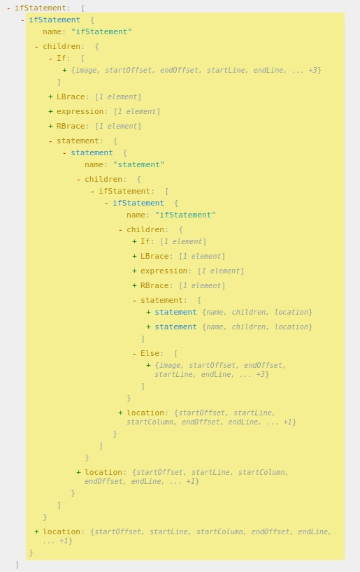

**Вопрос** скомпилируйте следующий файл и посмотрите содержимое секции .data с помощью objdump. По какому адресу начинается переменная x? Попробуйте убрать _Alignas(128) и объясните эффект.

без Alignas
``` 
Contents of section .data:
4000 00000000 00000000 08400000 00000000  .........@......
 4010 ffffffff ffffffff
```
с Alignas
``` 
Contents of section .data:
 4000 00000000 00000000 08400000 00000000  .........@......
 4010 00000000 00000000 00000000 00000000  ................
 4020 00000000 00000000 00000000 00000000  ................
 4030 00000000 00000000 00000000 00000000  ................
 4040 00000000 00000000 00000000 00000000  ................
 4050 00000000 00000000 00000000 00000000  ................
 4060 00000000 00000000 00000000 00000000  ................
 4070 00000000 00000000 00000000 00000000  ................
 4080 ffffffff ffffffff                    ........        
``` 

**Вопрос** напишите минимальный пример с таким кодом, скомпилируйте его со строгим соответствием стандарту C17 (-std=c17 -pedantic -Wall).  Что выведет компилятор? Объясните сообщение.
``` 
syntax.c:9:13: warning: implicit declaration of function ‘print’ [-Wimplicit-function-declaration]
    9 |             print("yes");
      |             ^~~~~
syntax.c:7:8: warning: suggest explicit braces to avoid ambiguous ‘else’ [-Wdangling-else]
    7 |     if (x > 0)
      |        ^
``` 

**Вопрос** найдите в AST для примера выше имя класса. Какие поля хранятся в узле этого дерева? Как вы думаете, зачем?
image: "Program"
startOffset: 13
endoffSet: 19
startLine: 1
endLine: 1
startColumn: 14
endColumn: 20
tokenTypeIdx: 3
полное описание положения имени класса в исходном файле. 
Зачем: Информация для компилятора, (вывести где ошибка)


**Задание** 0.5 найдите в AST для примера выше конструкцию if. Добавьте код так, чтобы повторить ситуацию с вложенным в if предложением if-else из первого примера. Нарисуйте примерный вид AST для него.



**Вопрос** Что выведется в stdout? Если это неожиданный результат, как переписать dbl чтобы избавиться от нежелательного и неожиданного поведения?
вывод: 9
#define dbl(y) (y) * 2
вывод: 12

**Задание 1** Напишите программу которая будет использовать этот макрос для вывода переменной, числа и константы, заданной с использованием макроса. Протестируйте её с помощью ключа -E для gcc/clang.
```
int main() {
    int x = 3;
    printf("x" " is %d", x );
    printf("19" " is %d", 19 );
    printf("CONST" " is %d", 25 );
    return 0;
}
```

**Вопрос** Что будет если написать print_var(42) ?
```
printf("42" " is %d", 42 );
```

**Вопрос** Протестируйте эту программу с помощью ключа -E для gcc/clang.
```
int main() {
  int64_t x = 42;
  double d = 99.99;

  int64_t_print(x);
  newline_print("");
  double_print(d);
  newline_print("");

  return 0;
}
```

**Вопрос** Протестируйте эту программу с помощью ключа -E для gcc/clang. Что раскрывается раньше: _Generic или #define?
define раньше
```
int main() {
  int64_t x = 42;
  double d = 99.99;

  _Generic((x), int64_t : int64_t_print(x), double : double_print(x), default : error("Unsupported operation"));
  newline_print();
  _Generic((d), int64_t : int64_t_print(d), double : double_print(d), default : error("Unsupported operation"));
  newline_print();

  return 0;
}
```